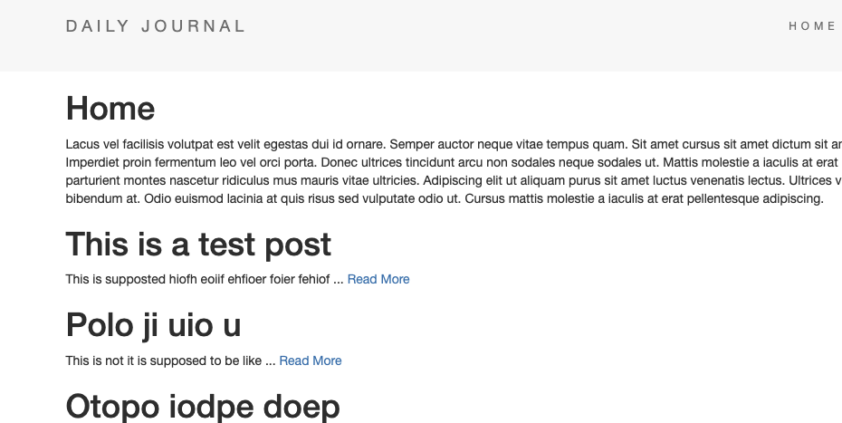

# SIMPLE-BLOG-APP
This is a Simple Blog App from London App Brewery's Udemy Course 

 

## How It's Made:

**Tech used:** HTML, CSS, JavaScript, MongoDB, Mongoose, Node.js and Express

This project was reworked using the express framework and hosted on Heroku

## Use the Webapp

Simply run node app.js

